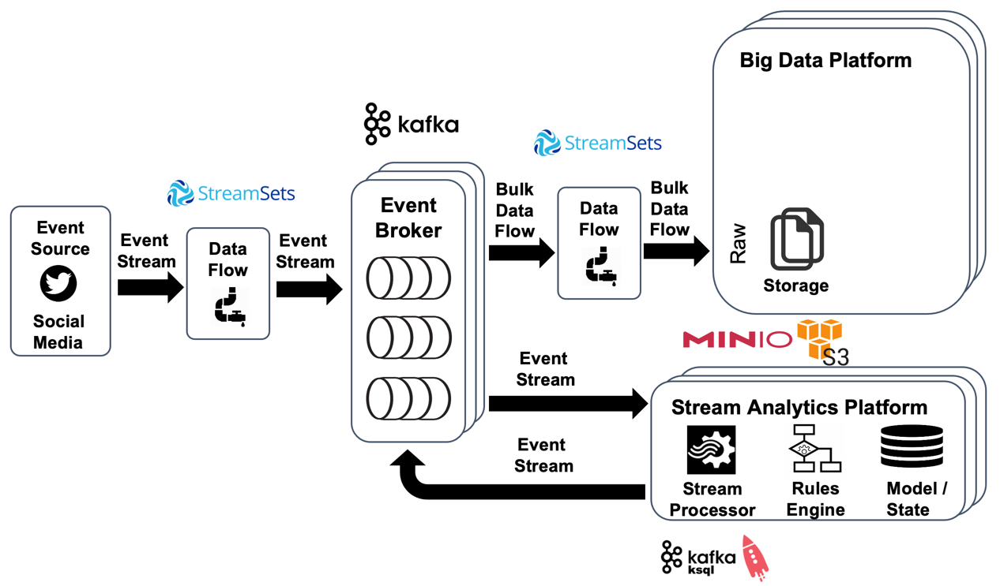
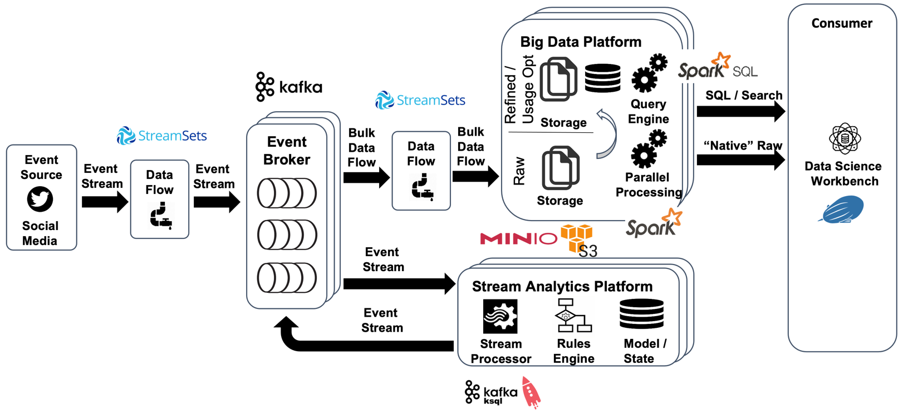

# Twitter Big Data & Fast Data Sample

This sample shows how to retrieve live twitter data and process it using both a batch processing pipeline, storing the data first in object storage as well as a stream analytics pipeline, where the data is analysed without storing it at all. 

## Ingesting Twitter Data into Kafka

In the 1st step, we will be using [StreamSets Data Collector](https://streamsets.com/products/dataops-platform/data-collector/) to consume live data from Twitter and publish the tweets retrieved into a Kafka topic.


Navigate to <http://dataplatform:18630> to open StreamSets and create a new pipeline. 

Add a `HTTP Client` origin and a `Kafka Producer` destination.

For the `HTTP Client` configure these properties:

* Tab **HTTP**
  * **Resource URL**: `https://stream.twitter.com/1.1/statuses/filter.json?track=fifa2022,WorldCup2022,fifaworldcup,QatarWorldCup2022,Qatar2022`
  * **Authentication Type**: `OAuth`
* Tab **Credentials**
  * Set **Consumer Key**, **Consumer Secret**, **Token** and **Token Secret** to the values gotten from the Twitter application (registered here: <https://developer.twitter.com/en/apps>)
* Tab **Data Format**
  * **Data Format**: `JSON`
  * **Max object Length (chars)**: `409600`     

For the `Kafka Producer` configure these properties:

* Tab **Kafka**
  * **Broker URI**: `kafka-1:19092`
  * **Topic**: `tweet-json`
* Tab **Data Format**
  * **Data Format**: `JSON`  

Create the Kafka Topic using the command line

```bash
docker exec -ti kafka-1 kafka-topics --create --topic tweet-json --partitions 8 --replication-factor 3 --zookeeper zookeeper-1:2181
```

To check for message, let's start a console consumer using the `kafkacat` utility. We can either have `kafkacat` installed locally or use the containerized version which is part of the platform.

```bash
docker exec -ti kcat kcat -b kafka-1:19092 -t tweet-json
```

Start the pipeline in StreamSets.

## Moving Data from Kafka to S3 compliant Object Storage

In the 2nd step, we will be using [StreamSets Data Collector](https://streamsets.com/products/dataops-platform/data-collector/) to consume the data we have previously written to the Kafka topic and store it in S3 Object Storage (either using the local Minio or the "real" AWS S3 object storage service).


First let's make sure that we have the necessary bucket available in the Object Storage, using one of the two options:

1. When using **Minio**, the necessary bucket has been created when starting the stack. We can easily check that by doing an `ls` 

```bash
docker exec -ti awscli s3cmd ls s3://tweet-bucket
```

2. When using **AWS S3 object storage service**, then the bucket has to be created via the S3 console on AWS. Make sure to use a globally unique name for the bucket, by for example adding your name as a prefix to `<yourname>-tweet-bucket`


Navigate to <http://dataplatform:18630> to open StreamSets and create a new pipeline. 

Add a `Kafka Consumer` origin and a `Amazon S3` destination. Add a `Expression Evaluator` in between the Kafka Consumer and the S3 destination.

For the `Kafka Consumer` configure these properties:

* Tab **Kafka**
  * **Broker URI**: `kafka-1:19092`
  * **Consumer Group**: `TweetConsumerV1`
  * **Topic**: `tweet-json`
  * **Zookeeper URI**: `zookeeper-1:2181`
  * **Max Batch Size (records)**: `10000`
  * **Batch Wait Time (ms)**: `200000`
* Tab **Data Format**
  * **Data Format**: `JSON`
  * **Max object Length (chars)**: `409600`     

For the `Expression Evaluator` configure these properties:

* Tab **General**
  * **Name:** `Date for Partitioning Extractor`
* Tab **Expressions**
  * **Header Attribute**: `year`
  * **Header Attribute Expression**: `${time:extractStringFromDate( time:millisecondsToDateTime( record:value('/timestamp_ms') ), 'yyyy')}` 
  * **Header Attribute**: `month`
  * **Header Attribute Expression**: `${time:extractStringFromDate( time:millisecondsToDateTime( record:value('/timestamp_ms') ), 'MM')}` 
  * **Header Attribute**: `day`
  * **Header Attribute Expression**: `${time:extractStringFromDate( time:millisecondsToDateTime( record:value('/timestamp_ms') ), 'dd')}` 
  * **Header Attribute**: `hour`
  * **Header Attribute Expression**: `${time:extractStringFromDate( time:millisecondsToDateTime( record:value('/timestamp_ms') ), 'HH')}` 

For the `Amazon S3` sink, configure the properties using one of the two options:

1. For Using the local **Minio Object Storage**, make the following configurations 

* Tab **Amazon S3** 

  * **Authentication Method**: `AWS Keys`
  * **Access Key ID**: `V42FCGRVMK24JJ8DHUYG`
  * **Secret Access Key**: `bKhWxVF3kQoLY9kFmt91l+tDrEoZjqnWXzY9Eza`
  * **Use Specific Region**: `X`
  * **Region**: `Other - specify`
  * **Endpoint**: `http://minio:9000`
  * **Bucket**: `tweet-bucket`
  * **Common Prefix**: `raw/tweets-v1`
  * **Partition Prefix**: `dt=${record:attribute('year')}-${record:attribute('month')}-${record:attribute('day')}/hr=${record:attribute('hour')}`
  * **Object Name Suffix**: `json`
  * **Delimiter**: `/`
  * **Use Path Style Address Model**: `X`

* Tab **Data Format**
  * **Data Format**: `JSON`

2. For Using the **AWS S3 object storage service**, make the following configurations 


* Tab **Amazon S3** 

  * **Authentication Method**: `AWS Keys`
  * **Access Key ID**: *add credentials from AWS*
  * **Secret Access Key**: *add credentials from AWS*
  * **Bucket**: `<prefix>-tweet-bucket` *(make sure to change the prefix to what you have used when creating the bucket in S3)*
  * **Common Prefix**: `raw/tweets-v1`
  * **Partition Prefix**: `dt=${record:attribute('year')}-${record:attribute('month')}-${record:attribute('day')}/hr=${record:attribute('hour')}`
  * **Object Name Suffix**: `json`
  * **Delimiter**: `/`

* Tab **Data Format**
  * **Data Format**: `JSON`


Start the pipeline in StreamSets. As soon as there are `10000` tweets available in the Kafka topic, the first object should be written out to MinIO object storage. 

Navigate to the MinIO Browser on <http://dataplatform:9000> and check that the bucket is being filled.

## Processing Tweets in real-time using ksqlDB

In the 3rd step, we will be using a Stream Analytics component called [ksqlDB](https://ksqldb.io/) to process the tweets form the `tweets-json` Kafka topic in real-time. ksqlDB offers a familiar SQL-like dialect, which we can use to query from data streams. 



We first start the ksqlDB CLI and connect to the ksqlDB engine

``` bash
docker exec -it ksqldb-cli ksql http://ksqldb-server-1:8088
```

Now we have to tell ksqlDB the structure of the data in the topic, as the Kafka topic itself is "schema-less", the Kafka cluster doesn't know about the structure of the message. We do that by creating a STREAM object, which we map onto the Kafka topic `tweet-json`. 

```sql
CREATE STREAM tweet_json_s (created_at VARCHAR
                    , id BIGINT
                    , text VARCHAR
                    , source VARCHAR
                    , user STRUCT<screen_name VARCHAR, location VARCHAR>
                    , favourites_count INT
                    , statuses_count INT
                    , favorited BOOLEAN
                    , retweeted BOOLEAN
                    , lang VARCHAR
                    , entities STRUCT<hashtags ARRAY<STRUCT<text VARCHAR>>
                                            , urls ARRAY<STRUCT<display_url VARCHAR, expanded_url VARCHAR>>
                                            , user_mentions ARRAY<STRUCT<screen_name VARCHAR>>>  
            ) WITH (KAFKA_TOPIC='tweet-json', VALUE_FORMAT='JSON');
```

We don't map all the properties of the tweet, only some we are interested in. 

Now with the STREAM in place, we can use the SELECT statement to query from it

```sql
SELECT * FROM tweet_json_s EMIT CHANGES;
```

We have to specify the `EMIT CHANGES` clause, as we are querying from a stream and therefore the data is continuously pushed into the query (so called push query).

We can also selectively only return the data we are interested in, i.e. the `id`, the `text` and the `source` fields.

```sql
SELECT id, text, source FROM tweet_json_s EMIT CHANGES;
```

Let's work with some nested fields. Inside the `entities` structure there is a `user_mentions` array, which holds all the users being mentioned in a tweet. 

```sql
SELECT text, entities->user_mentions 
FROM tweet_json_s EMIT CHANGES;
```

With that we can easily check the array for all the tweets where `@realDonaldTrump` is mentioned

```sql
SELECT id
		, text 
FROM tweet_json_s 
WHERE array_contains(entities-> user_mentions, STRUCT(screen_name :='realDonaldTrump')) = true  
EMIT CHANGES;
```

In the `entities` structure, there is also a `hashtags` array, which lists all the hashtags used in a tweet. 


Let's say we want to produce trending hashtags over a given time. In KSQL, we also have a way to do aggregations with the `SELECT COUNT(*) FROM ... GROUP BY` statement, similar to using it with relational databases. 

In order to use that, we first have to flatten the array, so we only have one hashtag per result. We can do that using the `EXPLODE` function

```sql
SELECT id
	, text
	, EXPLODE(entities->hashtags)->text AS hashtag
FROM tweet_json_s 
EMIT CHANGES; 
```

Unfortunately we can't use the `EXPLODE` function in the `GROUP BY`, so we first have to produce the flattened result into a new Stream (with an other Kafka Topic behind) and then do the aggregation on that. 

```sql
CREATE STREAM tweet_hashtag_s
WITH (kafka_topic='tweet_hashtag')
AS
SELECT id
	, text
	, EXPLODE(entities->hashtags)->text AS hashtag
FROM tweet_json_s 
EMIT CHANGES; 
```

This produces a Stream Analytics job which now continuously run in the background and read from the `tweet_json_s`, flattens the hashtags and produces the result into the newly created `tweet_hashtag_s` stream.

On that new stream we can now do aggregation. Because a stream is unbounded, we have to specify a window over which the aggregation should take place. We are using a 1 minute window.

```sql
SELECT hashtag
	, count(*) AS count
FROM tweet_hashtag_s 
WINDOW TUMBLING (SIZE 60 seconds) 
GROUP BY hashtag
EMIT FINAL;
```

By using the `EMIT FINAL`, we specify that we only want to get a result at the end of the window.

## Storing Tweets in Elasticsearch

In the 4th step, we will be using the [Elasticsearch](https://www.elastic.co/elastic-stack) NoSQL datastore to persist the tweets for later retrieval by Kibana. Elasticsearch is popular for its text-based search capabilities.


Navigate to <http://dataplatform:18630> to open StreamSets and create a new pipeline. 

Add a `Kafka Consumer` origin and a `Elasticsearch` destination.

For the `Kafka Consumer` configure these properties:

* Tab **Kafka**
  * **Broker URI**: `kafka-1:19092`
  * **Consumer Group**: `tweet-json-to-es`
  * **Topic**: `tweet-json`
  * **Zookeeper URI**: `zookeeper-1:2181`
  * **Max Batch Size (records)**: `1000`
  * **Batch Wait Time (ms)**: `2000`
* Tab **Data Format**
  * **Data Format**: `JSON`
  * **Max object Length (chars)**: `409600`   


For the `Elasticsearch` configure these properties (as the MinIO is part of the self-contained platform, we can put the Access key and Secret Access key here in the text):

* Tab **Elasticsearch**
  * **HTTP URL**: `http://elasticsearch-1`
  * **HTTP Port**: `9200`
  * **Index**: `tweet`
  * **Mapping**: `tweet-mapping`

Add a `Field Type Converter` after the `Kafka` origin. 

* Tab **Conversions**
  * **Conversion Method**: `By Field Name`
  * **Fields to Convert**: `/created_at`
  * **Convert to Type**: `DATETIME`
  * **Date Format**: `Other..`
  * **Other Data Format**: `EEE MMM dd HH:mm:ss Z yyyy`
 
Add a `Expression Evaluator` after the `Field Type Converter` processor. 

* Tab **Expressions**
  * **Output Field**: `/created_at`
  * **Field Expression**: `${time:extractStringFromDate( record:value('/created_at'),'yyyy/MM/dd HH:mm:ss')}`

## Processing Tweets using Apache Spark

In the 5th step, we will be using [Apache Spark](https://spark.apache.org/) to process the tweets we have stored in object storage. We will be using Apache Zeppelin for executing the Apache Spark statements in an "ad-hoc" fashion.



Navigate to <http://dataplatform:28080> to open Apache Zeppelin and login as user `admin` with password `changeme`. Create a new notebook using the **Create new note** link. 

Now let's read all the data we have stored to MinIO object storage so far, using the `spark.read.json` command

```scala
val tweetRawDf = spark.read.json("s3a://tweet-bucket/raw/tweets_v1/")
```

Spark returns the result as a Data Frame, which is backed by a schema, derived from the JSON structure. We can use the `printSchema` method on the data frame to view the schema.

```scala
tweetRawDf.printSchema()
```

the schema is quite lengthy, here only the start and the end is shown, leaving out the details in the middle

```scala
root
 |-- contributors: string (nullable = true)
 |-- coordinates: struct (nullable = true)
 |    |-- coordinates: array (nullable = true)
 |    |    |-- element: double (containsNull = true)
 |    |-- type: string (nullable = true)
 |-- created_at: string (nullable = true)
 |-- display_text_range: array (nullable = true)
 |    |-- element: long (containsNull = true)
 |-- entities: struct (nullable = true)
 |    |-- hashtags: array (nullable = true)
 |    |    |-- element: struct (containsNull = true)
 |    |    |    |-- indices: array (nullable = true)
 |    |    |    |    |-- element: long (containsNull = true)
 |    |    |    |-- text: string (nullable = true)
 |    |-- media: array (nullable = true)
 |    |    |-- element: struct (containsNull = true)
 |    |    |    |-- additional_media_info: struct (nullable = true)
 |    |    |    |    |-- description: string (nullable = true)
 |    |    |    |    |-- embeddable: boolean (nullable = true)
 |    |    |    |    |-- monetizable: boolean (nullable = true)
 |    |    |    |    |-- title: string (nullable = true)
 ...
 ...
 |-- source: string (nullable = true)
 |-- text: string (nullable = true)
 |-- timestamp_ms: string (nullable = true)
 |-- truncated: boolean (nullable = true)
 |-- user: struct (nullable = true)
 |    |-- contributors_enabled: boolean (nullable = true)
 |    |-- created_at: string (nullable = true)
 |    |-- default_profile: boolean (nullable = true)
 |    |-- default_profile_image: boolean (nullable = true)
 |    |-- description: string (nullable = true)
 |    |-- favourites_count: long (nullable = true)
 |    |-- follow_request_sent: string (nullable = true)
 |    |-- followers_count: long (nullable = true)
 |    |-- following: string (nullable = true)
 |    |-- friends_count: long (nullable = true)
 |    |-- geo_enabled: boolean (nullable = true)
 |    |-- id: long (nullable = true)
 |    |-- id_str: string (nullable = true)
 |    |-- is_translator: boolean (nullable = true)
 |    |-- lang: string (nullable = true)
 |    |-- listed_count: long (nullable = true)
 |    |-- location: string (nullable = true)
 |    |-- name: string (nullable = true)
 |    |-- notifications: string (nullable = true)
 |    |-- profile_background_color: string (nullable = true)
 |    |-- profile_background_image_url: string (nullable = true)
 |    |-- profile_background_image_url_https: string (nullable = true)
 |    |-- profile_background_tile: boolean (nullable = true)
 |    |-- profile_banner_url: string (nullable = true)
 |    |-- profile_image_url: string (nullable = true)
 |    |-- profile_image_url_https: string (nullable = true)
 |    |-- profile_link_color: string (nullable = true)
 |    |-- profile_sidebar_border_color: string (nullable = true)
 |    |-- profile_sidebar_fill_color: string (nullable = true)
 |    |-- profile_text_color: string (nullable = true)
 |    |-- profile_use_background_image: boolean (nullable = true)
 |    |-- protected: boolean (nullable = true)
 |    |-- screen_name: string (nullable = true)
 |    |-- statuses_count: long (nullable = true)
 |    |-- time_zone: string (nullable = true)
 |    |-- translator_type: string (nullable = true)
 |    |-- url: string (nullable = true)
 |    |-- utc_offset: string (nullable = true)
 |    |-- verified: boolean (nullable = true)
 |-- withheld_in_countries: array (nullable = true)
 |    |-- element: string (containsNull = true)
```

We can see that a tweet has a hierarchical structure and that the tweet text it self, the `text` field is only one part of much more information.

Optionally to restrict on the data, we can use the partitioning applied on the object storage

```scala
import org.apache.spark.sql.functions._

case class Config(year: String = null,
                  month: String = null,
                  day: String = null,
                  hour: String = null)

val config = Config("2022", "11", "24", "12")

val tweetFilteredDf = tweetRawDf.filter (s"dt = to_date('${config.year}${config.month}${config.day}','yyyyMMdd') and hr = '${config.hour}'")
```

Now let's use the `cache` method to cache the data in memory, so that further queries are more efficient

```scala
val tweetRawCachedDf = tweetRawDf.cache()
```

or if a filter has been used above

```scala
val tweetRawCachedDf = tweetFilteredDf.cache()
```


Let`s see one record of the data frame

```scala
tweetRawCachedDf.show(1)
```

We can also ask the data frame for the number of records, using the `count` method

```scala
tweetRawCachedDf.count()
```

Spark SQL allows to use the SQL language to work on the data in a data frame. We can register a table on a data frame.
 
```scala
tweetRawCachedDf.createOrReplaceTempView("tweets")
```

With the `tweets` table registered, we can use it in a SELECT statement. Inside spark, you can use the `spark.sql()` to execute the SELECT statement.

But with Zeppelin, there is also the possibility to use the `%sql` directive to directly work on the tables registered

```sql
 %sql
SELECT * FROM tweets
```

We can also do the count using SQL

```sql
%sql
SELECT COUNT(*) FROM tweets
```

and there are many SQL functions available and we can also work on the hierarchical data, such as `entities.hashtags.text`. First let's see only tweets, which have at least one hashtag
 
```sql
%sql
SELECT text, entities.hashtags.text 
FROM tweets 
WHERE SIZE(entities.hashtags) > 0
```

We can use that statement in a so called inline view and count how often a hashtag has been mentioned over all and sort it descending.

```sql
%sql
SELECT hashtag, COUNT(*) nof 
FROM (
	SELECT LOWER(hashtag.text) AS hashtag 
	FROM tweets LATERAL VIEW EXPLODE(entities.hashtags) hashtags AS hashtag ) 
	GROUP BY hashtag
ORDER BY nof desc
```

Let's say this is the result we want to make available. We can now turn it into a spark statement by placing it inside the `spark.sql` method call. 

```scala
val resultDf = spark.sql("""
    SELECT hashtag, COUNT(*) nof 
    FROM (
	    SELECT LOWER(hashtag.text) AS hashtag 
	    FROM tweets LATERAL VIEW EXPLODE(entities.hashtags) hashtags AS hashtag ) 
	    GROUP BY hashtag
    ORDER BY nof desc
""")
```

The result of the `spark.sql` is another, new data frame, which we can either do further processing on, or store it using the `write.parquet` method

```scala
resultDf.write.parquet("s3a://tweet-bucket/result/hashtag-counts")
```

We store it in object storage in the same bucket as the raw data, but use another path `result/hashtag-counts` so that we can distinguish the raw twitter data from the `hashtag-counts` data. We also no longer use json as the data format but the more efficient parquet data format.

## Using Trino to query the result in object storage

In this last step, we are using [Trino](https://trino.io/) engine to make the result data we have created in the previous step available for querying over SQL. 


To make the data in object storage usable in Trino, we first have to create the necessary meta data in the Hive Metastore. The Hive Metastore is similar to a data dictionary in the relational world, it stores the meta information about the data stored somewhere else, such as in object storage. 

We first start the Hive Metastore CLI

```bash
docker exec -ti hive-metastore hive
```

and create a database 

```sql
CREATE DATABASE twitter_data;
```

and then switch to that database

```sql
USE twitter_data;
```

Databases allow to group similar data. 

Inside the database, we can now create a table, which wraps the data in object storage. We create a table for the data in the `result/hashtag-counts` folder

```sql
DROP TABLE IF EXISTS hashtag_count_t;
CREATE EXTERNAL TABLE hashtag_count_t (hashtag string, nof integer)
STORED AS PARQUET LOCATION 's3a://tweet-bucket/result/hashtag-counts';  
```

With the table in place, we can quit the CLI using the `exit;` command.

Now let's start the Presto CLI and connect to the `presto-1` service

```bash
docker exec -ti trino-cli trino --server trino-1:8080 --catalog minio
```

We then switch to the `minio` catalog and the `twitter_data` database, which matches the name of the database we have created in the Hive Metastore before

```sql
use minio.twitter_data;
```

A show tables should show the one table `hashtag_count_t` we have created before

```sql
show tables;
```

Now we can use `SELECT` to query from the table

```sql
SELECT * FROM hashtag_count_t;
```

We can also count how many hashtags we have seen so far

```sql
SELECT count(*) FROM hashtag_count_t;
```

Presto can be integrated into many standard data analytics tools, such as PowerBI or Tableau any many others.

## Using Athena (if on S3)


```sql
DROP TABLE tweet.tweets;
CREATE EXTERNAL TABLE IF NOT EXISTS tweet.tweets (
	created_at string,
	id bigint,
	id_str string,
	text string,
	source string,
	truncated boolean,
	in_reply_to_status_id bigint,
	in_reply_to_status_id_str string,
	in_reply_to_user_id bigint,
	in_reply_to_user_id_str string,
	in_reply_to_screen_name string,
	user struct<
		id: bigint,
		id_str: string,
		name: string,
		screen_name: string,
		location: string,
		url: string,
		description: string,
		translator_type: string,
		protected: boolean,
		verified: boolean,
		followers_count: int,
		listed_count: int,
		favourites_count: bigint,
		statuses_count: bigint,
		created_at: string,
		utc_offset: string,
		time_zone: string,
		geo_enabled: boolean,
		lang: string,
		contributors_enabled: boolean,
		is_translator: boolean
	>,
	place string,
	retweeted_status struct<
		created_at: string,
		id: bigint,
		id_str: string,
		text: string,
		display_text_range: string,
		source: string,
		truncated: boolean,
		in_reply_to_status_id: bigint,
		in_reply_to_status_id_str: string,
		in_reply_to_user_id: bigint,
		in_reply_to_user_str: string,
		in_reply_to_screen_name: string
	>,
	is_quote_status boolean,
	quote_count bigint,
	reply_count bigint,
	retweet_count bigint,
	favorite_count bigint,
	entities struct<
		hashtags: ARRAY<STRUCT<
			text: string
		>>,
		urls: ARRAY<STRUCT<
			url: string,
			expanded_url: string,
			display_url: string
		>>
	>,
	favorited boolean,
	retweeted boolean,
	filter_level string,
	lang string,
	timestamp_ms bigint
)
PARTITIONED BY (dt string, hr string)
ROW FORMAT SERDE 'org.openx.data.jsonserde.JsonSerDe'
LOCATION 's3://tweet-bucket/raw/tweets_v1';
```

```
MSCK REPAIR TABLE `tweet.tweets`;
```

